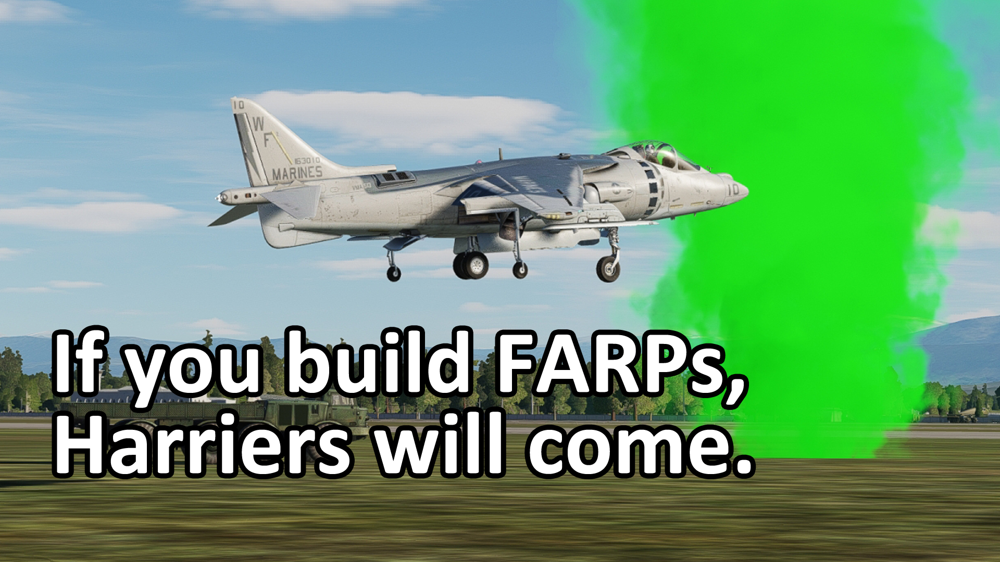
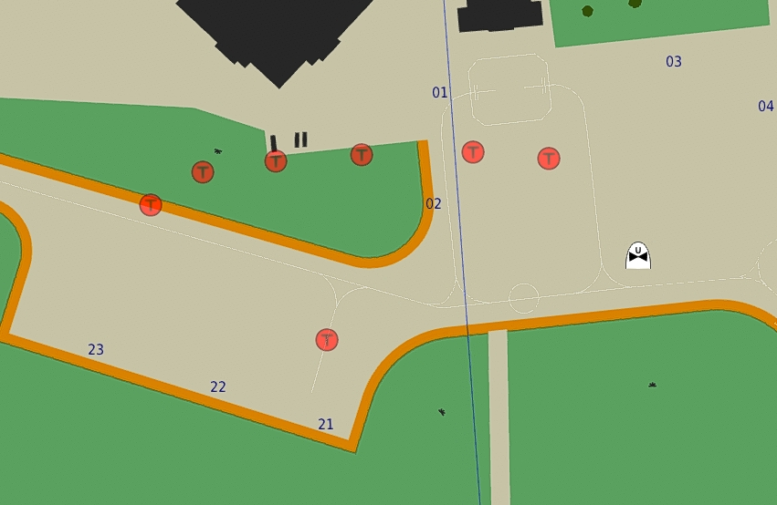

# Moveable FARPs Proof of Concept

Saw this feature on a server and they didn't explain how they did it, so I wanted to try recreating it. Basically you can move around the Invisible FARP using mist.teleportToPoint. More complicated uses of this, when combined with the slot blocker, could be to allow players to "build" FARPs at arbitrary points on the map as forward bases.

## Update!
Since posting this, the Strategic DCS dev has weighed in with their thoughts. [See the original developer's notes below!](#Notes-from-the-original-developer)

## [Click to watch a demo of this!](https://www.youtube.com/watch?v=-3xZhQB6xmc)



This is insanely cool, and I think there's a lot of potential uses for this on online servers. Many thanks to EatLeadCobra for figuring out the trick, and many, *many* thanks to the scripting folks on hoggit (kukiric and MARLAN) who guided me through setting up the environment and the volatile minefield that is DCS scripting!

### Pre-requisites

This 100% requires the [**Mist Mission Scripting Tools**](https://github.com/mrSkortch/MissionScriptingTools). Included in the repository is the version of Mist I happened to use, but the latest version can always be found elsewhere.

While not strictly required, to get the most out of this, you'll probably also want [**Ciribob's Simple Slot Block**](https://github.com/ciribob/DCS-SimpleSlotBlock). Using this allows the slots attached to the FARP to be dynamically blocked based on script.

## What's in the demo?

The demo mission, has two Mi-8s, and two AV8Bs.

The Mi-8s are the FARP Builders, and using the F10 menu, can build a (shared) FARP. The FARP is spawned 50 meters in front of Mi-8s, and requires that they be stopped and landed on the ground. Once the FARP has been built, a green smoke will be put on it, and a map marker is created on the FARP.

If the Mi-8's deploy another FARP, the active FARP will be moved, along with the marker which gets displayed on the map.

Once the FARP has been built, the AV8B slots can be selected, and will spawn on the most recent FARP.

## How does it work?

The short answer:

1. Make a "Invisible FARP" static object, and make sure both its name fields match.
2. Add player aircraft near the FARP with the "ramp start" or similar options which cause it to snap to the FARP.
3. Use [`mist.teleportToPoint`](https://wiki.hoggitworld.com/view/MIST_teleportToPoint) to teleport the FARP somewhere else.
4. The group will spawn on the FARP even after it's been moved.

```lua
local teleportVars = {}
teleportVars.gpName = farpName
teleportVars.action = "teleport"
teleportVars.point = buildPoint
mist.teleportToPoint(teleportVars)
```

At it's core, that's basically it! I've tested this on local multiplayer and when hosted on the dedicated server and it still works... most of the time.

This moving of the FARP around doesn't feel like intended behavior, so it's possible this is relying on a load bearing bug that could eventually get fixed.

## Technical notes

### Keeping the demo as simple as possible

I've played on a bunch of different DCS servers, and messing around with scripting has given me a whole new appreciation for the difficulty that server operators go through to keep things running smoothly.

With that in mind, I built out the demo to be as simple as possible. It's not the most robust thing ever made, but I didn't want any of the functions (especially the main function, `MoveFarp`) to make too many assumptions about how a server is setup.

For example, the mission commands and slot blocking is done in a very, very basic way. I get the impression that every server has their own solution to this, so none of the code outside of `MoveFARP` is really meant to be taken as important or worth copying.

### Leaving lots of FARPs behind



At least in the case of these Invisible FARPs, the `mist.teleportToPoint` command seems to copy the FARPs rather than actually move them.

I *did* try to delete old FARPs myself, but no matter which variation of deleting objects I tried, I couldn't clean up the old FARPs. I don't know enough about DCS to say that it's impossible. I think there's a good chance somebody more experienced with scripting could fix this up.

The best way I was able to figure working around this was to place a map marker on the active FARP. More complex map markers would probably work even better.

### I don't know what happens if multiple planes try to spawn on the same FARP!

While I did test this on a dedicated server, I didn't test it with other people in the server. It's possible some of the logic is screwy (as in, it would be bad even without the whole FARP thing) just due to my inexperience with DCS scripting. Specifically, I don't know how DCS will handle somebody trying to spawn on the FARP if somebody is already sitting on that point.

### Spamming FARPs can sometimes cause it to fail?

I wasn't able to consistently reproduce this, but I noticed if I built FARPs in rapid succession and all near each other (as in the above image), then sometimes the Harrier would spawn on the original map designated FARP location.

Strategic DCS (the server this was inspired by) doesn't *appear* to have problems with their dynamic FARP spawning, but it's also a far more infrequent and labor intensive (on the part of the players) option so it's possible as long as people aren't doing this super often and spamming the commands this is a non-issue. This is something that would require more testing.

## Notes from the original developer!

Martin from [Strategic DCS](https://strategic-dcs.com/) has shared new information on their implementation!

1. I do consider it a total hack that seems to work...for now

2. If you, or another unit (destroyed or otherwise) is on the invisible farp etc. and another player tries to spawn, instead of getting flight is delayed, they'll spawn at the original miz location - the new world.removeJunk is very useful to avoid this and also monitor player births and perhaps kick back to spectators with your own "flight is delayed" style thing

3. If you teleport it more than once, the issue of respawning at original miz location seems to occur more often

4. If you use world.getAirbases() it'll have duplicate IDs so need to dedupe, and you will get scripting errors if you try accessing some functions on the old one (hasAttribute I believe it was will throw errors) so filter accordingly to ensure the right calls on the right objects

### Additional comments

To avoid (3) I have 20 farps for each coalition out the way of the map and keep note of any farp deployed within the running session

To handle FARP establishment / slotability I just use onPlayerTryChangeSlot hook - but given all my logic is running outside DCS (download the miz, you'll find it's a very empty miz file with just the units in) I push the state to DCS's hook environment and then have onPlayerTryChangeSlot lookup in a table very quickly / locally to ensure it remains fast

